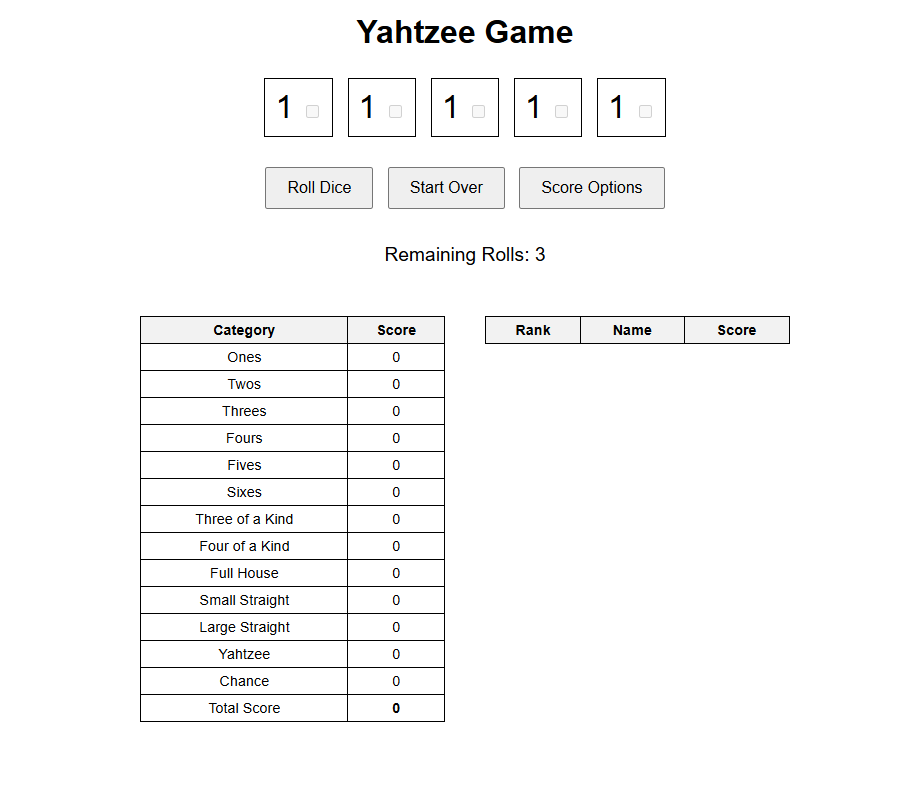
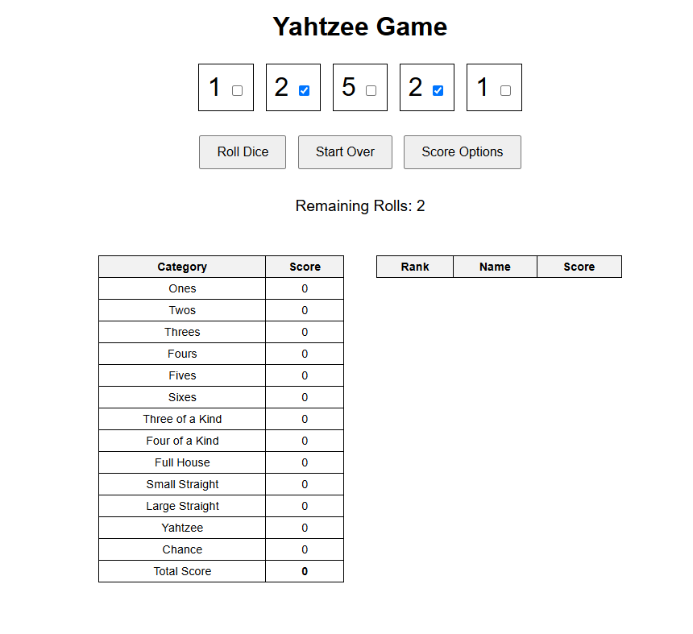
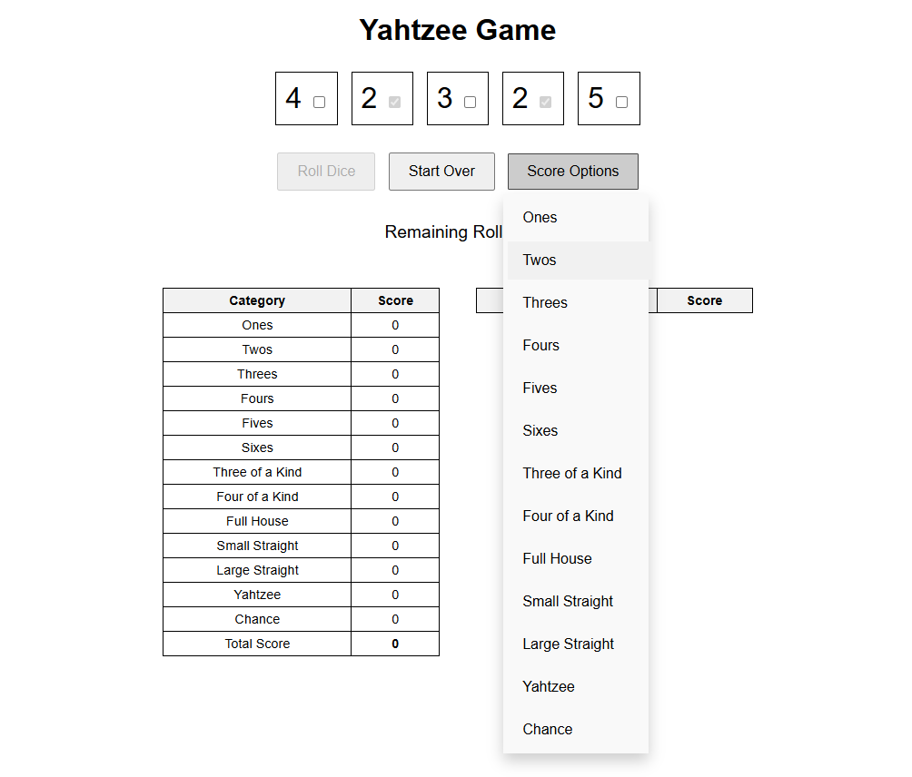
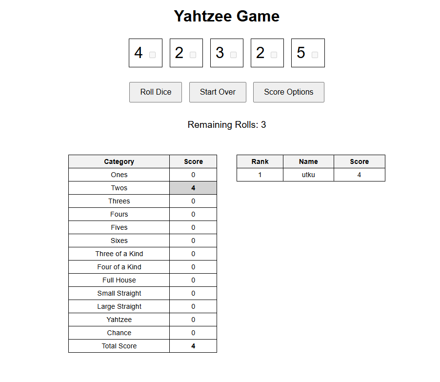

# Yahtzee Game

This version of our Yahtzee game includes a PHP server component for managing the scoring by using AJAX to communicate between the HTML/CSS/JS client with the PHP server. 

## Features

- Roll up to five dice up to three times.
- Choose which dice to keep after each roll.
- Score based on classic Yahtzee categories.
- View a leaderboard of the top 10 scores.
- Start over to reset the game.

## How to Play

1. Click the "Roll Dice" button to roll the dice.
2. Check the boxes next to the dice you want to keep.
3. Roll the remaining dice up to two more times.
4. Select a category from the "Score Options" dropdown to score your roll.
5. The game will submit your score and update the leaderboard.
6. Click "Start Over" to reset the game and play again.

## Installation

1. Run "php -S localhost:8000" on a command line in the versions/02/public directory.
1. Navigate to localhost:8000 on your browser.

## Files

- `index.html` - The main HTML file for the game interface.
- `styles.css` - The CSS file for styling the game interface.
- `script.js` - The JavaScript file for game logic and interactivity.
- `server.php` - The PHP file for managing the game state and scoring.

## Game States
## Initial State

## After rolling dice and keeping 2's

## Rolling dice again and choosing the scoring option

## You will be prompted to enter your name and see it on the leaderboard!
(The leaderboard will automatically sort the scores.)

