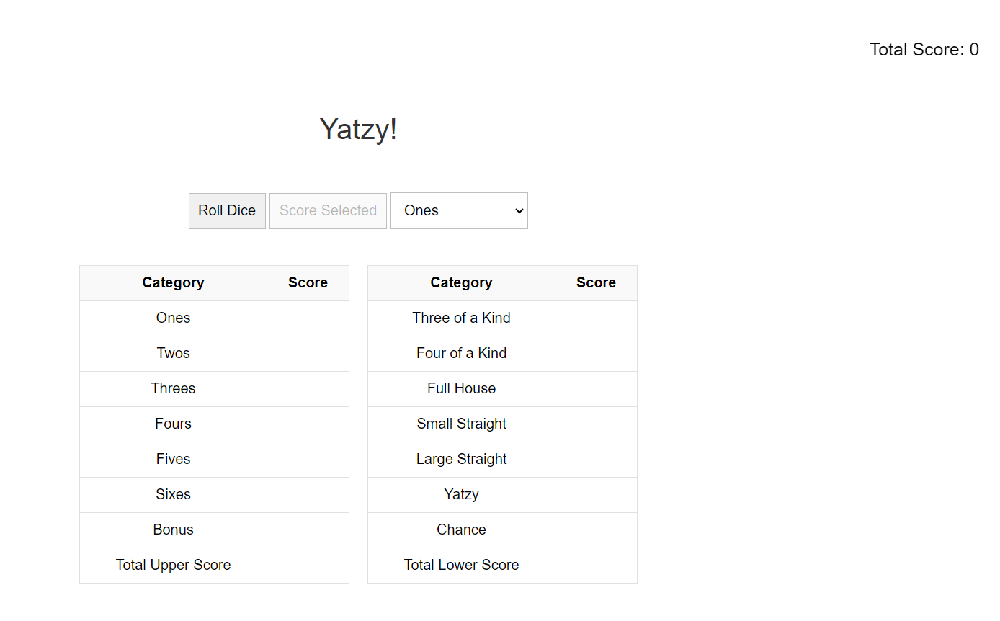
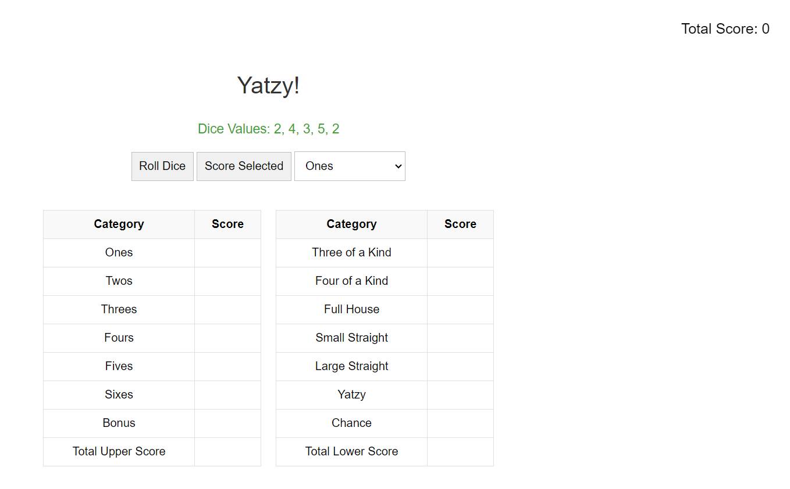
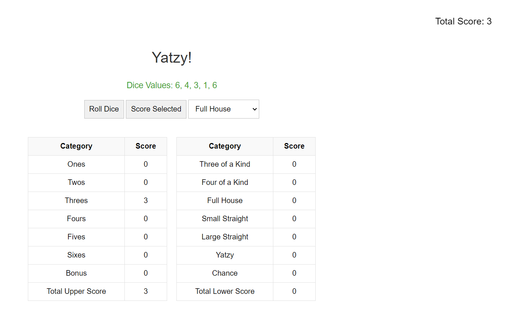
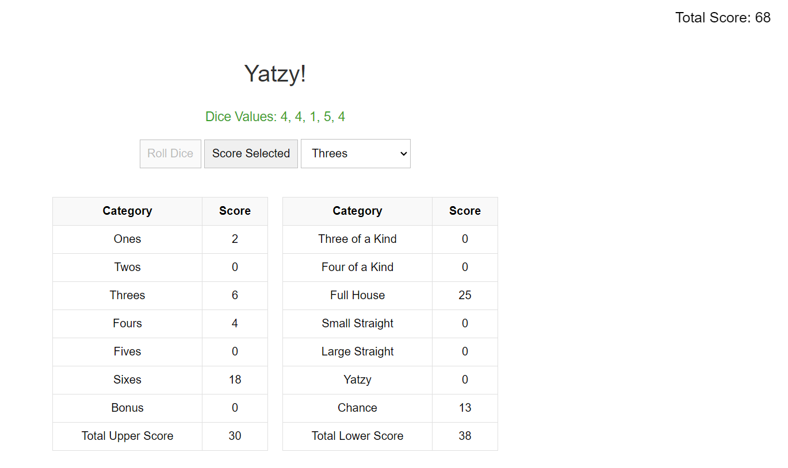

# Yatzy Game

Welcome to the Yatzy Game! This is a single-player Yatzy game completely in HTML/JS/CSS.
The game will enforce the rules of Yatzy, will manage the game state (current score, current role, etc.)
and will notify the user of the final score when the game is done.

## Table of Contents
- [Installation](#installation)
- [Design System](#design-system)
- [Screenshots](#screenshots)


## Installation

To run the game locally, follow these steps:

1. Clone the repository:
    ```bash
    git clone https://github.com/ChadaBendriss/yatzy
    ```

2. Navigate to the project directory:
    ```bash
    cd yatzy
    ```

3. Open `test.html` in your web browser to play the game.


## Design System
For more details on how we designed the look of the game, check out our
[Design System](/docs/design_system.md)

## Screenshots






