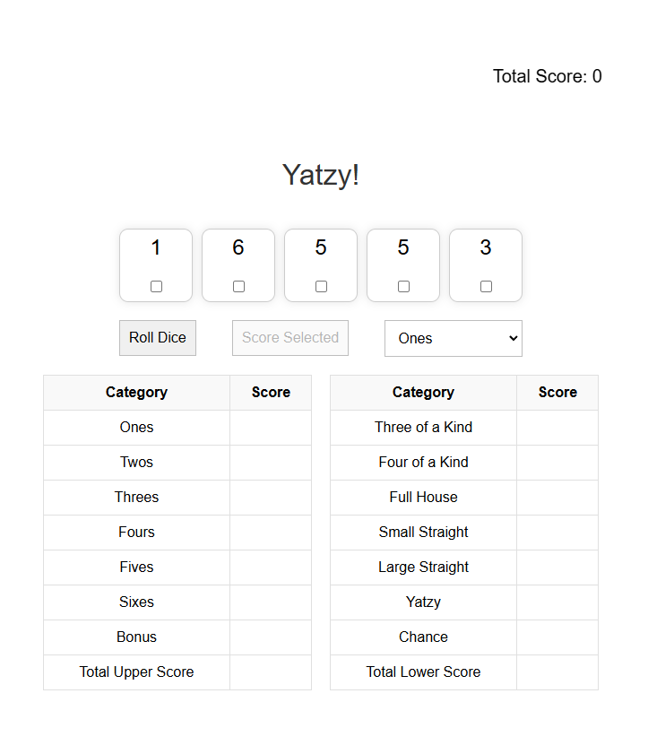
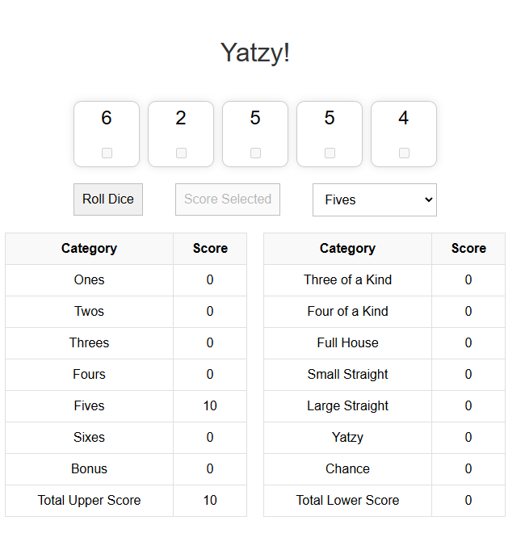
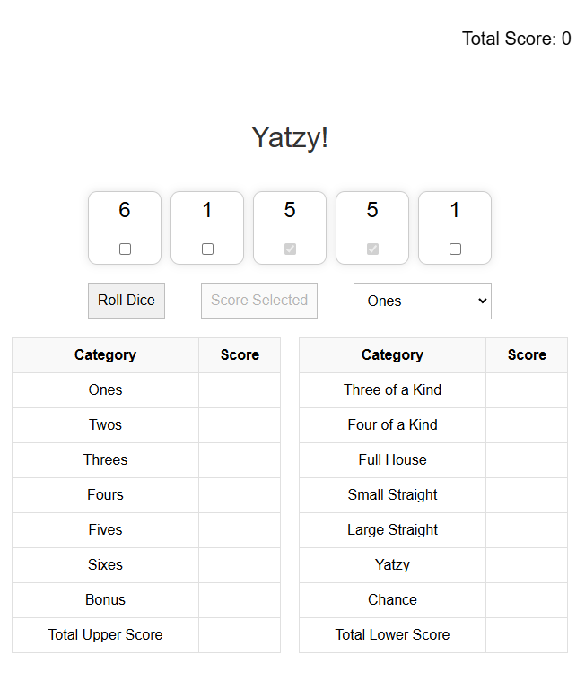

# Yatzy Game Design System

## Structural Components

### Headers
- **Main Header (`<h1>`)**
  - Font: Helvetica, Arial, sans-serif
  - Size: 36px
  - Weight: Normal
  - Color: #333
  - Alignment: Center

### Buttons
- **Primary Button (`Roll Dice`, `Score Selected`)**
  - Font: Helvetica, Arial, sans-serif
  - Size: 16px
  - Padding: 10px
  - Border: 1px solid #bebebe
  - Margin: 10px 20px
  - Background Color: #f9f9f9
  - Text Color: #000
  - Cursor: Pointer

### Select Dropdown
- **Score Selection (`<select>`)**
  - Font: Helvetica, Arial, sans-serif
  - Size: 16px
  - Padding: 10px
  - Border: 1px solid #bebebe
  - Margin: 10px 0

### Dice Container
- **Dice Wrapper (`#diceContainer`)**
  - Display: Flex
  - Justify Content: Center
  - Gap: 10px
  - Margin Top: 20px

- **Individual Dice (`.dice`)**
  - Width: 80px
  - Height: 80px
  - Display: Flex
  - Flex Direction: Column
  - Align Items: Center
  - Justify Content: Center
  - Border: 1px solid #ccc
  - Box Shadow: 0 0 10px rgba(0,0,0,0.1)
  - Border Radius: 10px

### Tables
- **Score Tables**
  - Width: 300px
  - Border Collapse: Collapse
  - Background Color: #fff

- **Table Headers (`<th>`)**
  - Background Color: #f9f9f9
  - Border: 1px solid #e0e0e0
  - Padding: 10px
  - Text Align: Center

- **Table Cells (`<td>`)**
  - Border: 1px solid #e0e0e0
  - Padding: 10px
  - Text Align: Center

### Scoreboard
- **Total Score Display (`#score-total`)**
  - Font: Helvetica, Arial, sans-serif
  - Size: 20px
  - Margin Top: 100px
  - Position: Fixed
  - Top: 0
  - Right: 70px

## Color Palette
- **Primary Text Color:** #000000
- **Secondary Text Color:** #333333
- **Button and Select Border Color:** #bebebe
- **Dice Box Border Color:** #ccc
- **Table Header Background Color:** #f9f9f9
- **Table Border Color:** #e0e0e0
- **Dice Number Color:** #3ba32d
- **Background Color:** #fff

## Fonts / Sizes
- **Font Family:** Helvetica, Arial, sans-serif
- **Main Header Size:** 36px
- **Button and Select Font Size:** 16px
- **Dice Number Font Size:** 24px
- **Scoreboard Font Size:** 20px
- **Table Cell Font Size:** 16px

## Screenshots

### Initial State

### Scoring

### Second Roll

